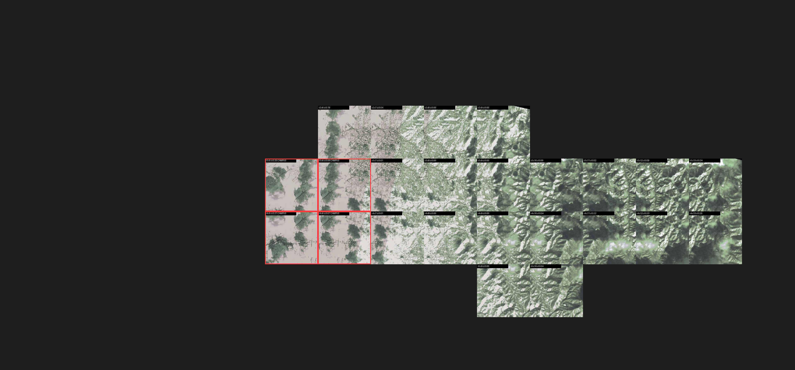
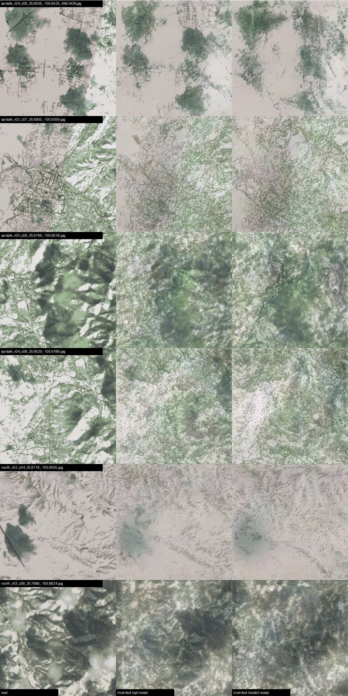
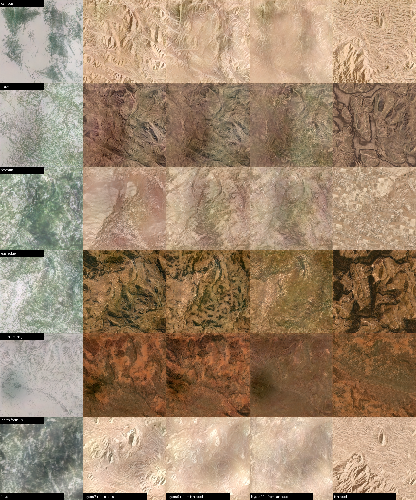
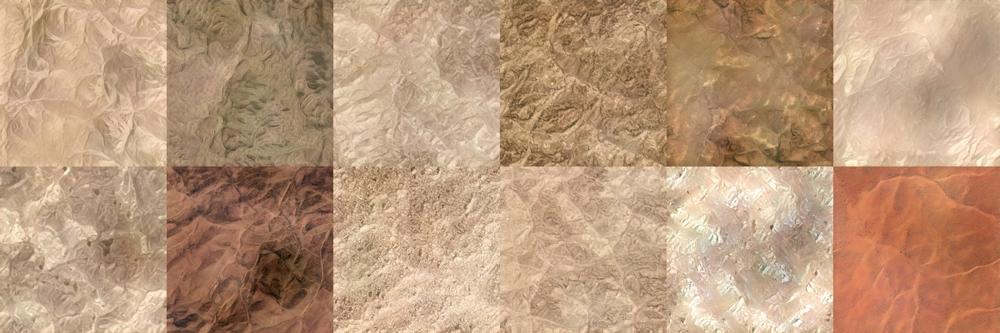

<video controls loop muted playsinline preload="metadata">
  <source src="/video/geomorphs_santafe_lpf_1280x720_web.mp4" type="video/mp4">
</video>

In 2021 I trained a StyleGAN2 on 190,000 satellite images that Planet Labs' classifier had flagged as _interesting_, and walked its latent space to a soundtrack generated from wind and hydrothermal recordings. The plan was to show it at Planet. Covid ended that. The write-up is [here](/posts/geomorphs/).

On October 1 the piece finally goes on a wall, at [Light in Mind](https://www.sciartsantafe.org/) on the Midtown Campus in Santa Fe. That changed what the piece should be. A wall in the high desert is not a gallery monitor, and it seemed wrong to project a random stretch of the Earth onto it. So I pointed the model at the ground it would be standing on.

## The Earth, returned to itself

Planet photographs the whole planet every day. In February 2021, while the collaboration was still alive, I had ordered two scenes: one covering Santa Fe and the Midtown Campus, one covering Tesuque and the foothills north of town. They sat on a drive for five years.

I cut them into 1024-pixel tiles at the model's training scale, twelve places in all: the campus itself, the Plaza, the foothills east of town, the high Sangre de Cristo ridges, Tesuque, the arroyos north of the pueblo. Then I inverted each one into the model's latent space, which means searching for the latent vector whose generated image most closely matches the real photograph.

The inversions are not copies. The model keeps the layout, the forest masses, the road corridors, the drainage, and forgets the fine detail. The Plaza's street grid, which the model has no vocabulary for, dissolves into texture. This is the piece: the real place, as a machine that has only ever seen the Earth from orbit half-remembers it.

## A palette for adobe

Santa Fe was under snow that week, and the campus walls are red. Snow, green forest and blue water all die on red stucco under a projector, because the wall reflects almost none of that light. Desert tones survive.

StyleGAN2 separates _what_ is in an image from _how it is colored_ across its layers. Keeping the Santa Fe layouts in the early layers and borrowing the color layers from desert seeds gives the twelve places a palette the wall can hold.

The walk visits the twelve places in a loop around the city: campus, east edge, foothills, mountains, north through Tesuque and the arroyos, back down through the Plaza and the east mesa. Between them the model interpolates, so the video is two minutes of landscapes that never existed, anchored every ten seconds by one that does.

## Notes for the wall

The show is silent, so the soundtrack that drove the original piece is gone, but its shape is still there: the low-frequency envelope of the 2021 wind recordings still sets the pace of the walk.

Terrain only reads as terrain at its true aspect. The shading that makes a ridge look like a ridge is a ratio of light to dark across a slope, and stretching the image to fit a wide surface breaks it; the mountains turn into wood grain. So the render is a 16:9 window of the square image, panning slowly down and back up over the two minutes, never stretched, never mirrored.

For the live part of the evening I am running a small corner-pin mapper I wrote in Godot, since none of the usual mapping software runs on Linux. It pins the video to any four corners, grades it live for the wall, and saves presets. More on that in a later post.

## Credits

Imagery: [Planet Labs PBC](https://www.planet.com), PlanetScope, 17 February 2021, used with permission for the original project. Model: StyleGAN2 (Karras et al.), trained 2021. Latent walk: built on Hans Brouwer's [maua-stylegan2](https://github.com/JCBrouwer/maua-stylegan2). Sound model (2021): SampleRNN on wind, ocean and hydrothermal recordings. Light in Mind is organized by SciArt Santa Fe, aweStruct / Brett Phares, and Morgan Bernard, who also leads the workshop.
